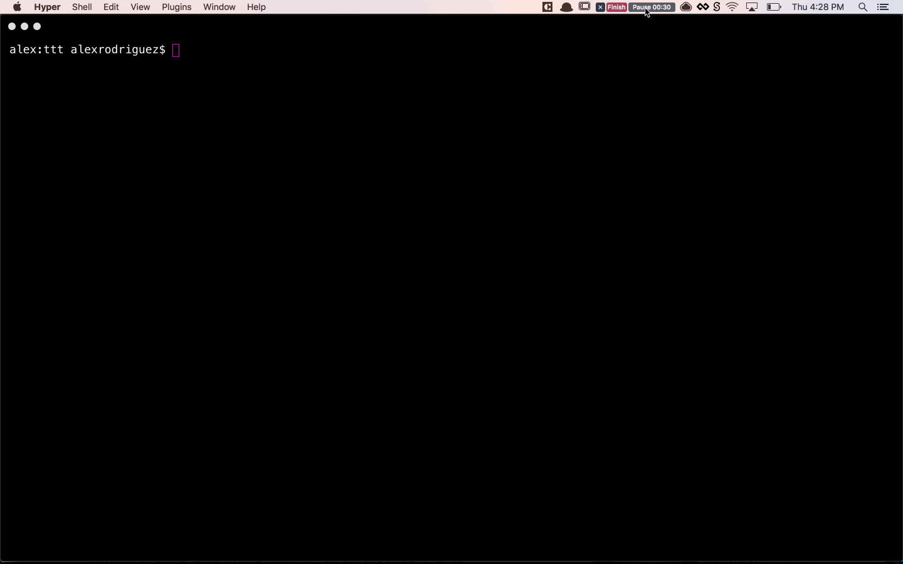
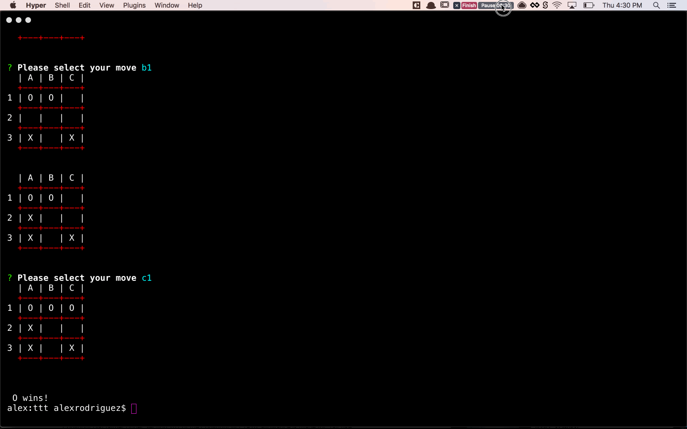

# Terminal Tic Tac Toe

A tic tac toe game in the terminal using 

- [colors-cli](https://www.npmjs.com/package/colors-cli)
- [inquirer](https://www.npmjs.com/package/inquirer)

### Run the game

```
$ git clone git@github.com:alexrdz/ttt.git
$ cd ttt/
$ npm i -S
$ npm run start
```


### Player O wins - horizontal




### Player X wins - diagonal



#### Fixes
I encountered a `call stack size exceeded` issue plus a small oversight in my diagonal check (l to r). I have made a couple slight changes to amend these issues. The changes are in a branch named `fix-one` but have not been merged so as to not change or update my original submission. **These alterations were done after due date** and are therefore not part of `master` branch.

#### Refactor

The `refactor` branch cleans up the code, particularly the `checkForWin` function. Also not merged into `master` branch to keep `master` as original submission.